# 01-analisis

Analisis de casos de uso preparado al estilo de pySigHor: cada caso separa descripcion funcional, colaboracion de analisis y secuencia entre vista, controlador, repositorio y entidades del dominio.

Cada caso contiene:

- `README.md`: analisis textual del caso, enlaces e imagenes de sus diagramas.
- `colaboracion.puml` / `colaboracion.svg`: colaboracion MVC de analisis.
- `secuencia.puml` / `secuencia.svg`: secuencia de analisis del caso.

Los diagramas originales de SdR estan en [00-casos-uso/02-detalle](../00-casos-uso/02-detalle/README.md).

## Diagramas de referencia SdR

Estos diagramas ayudan a situar actores, modulos y estados antes de entrar en cada caso concreto.

### Gestion de sesion y navegacion

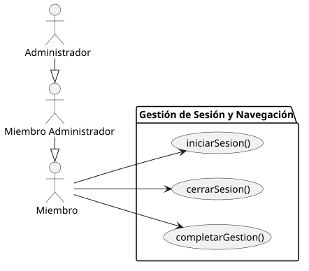

### Organizacion de grupos

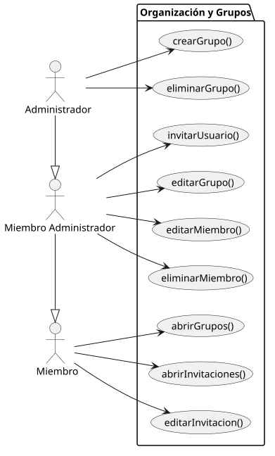

### Gestion de tareas

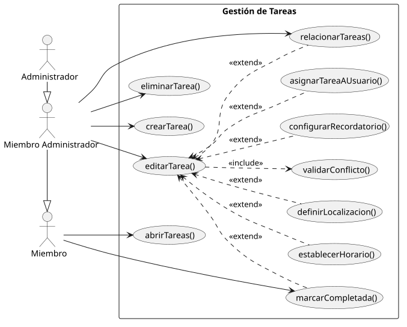

### Planificacion y detalles

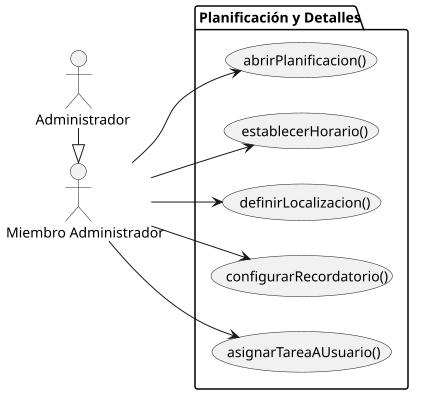

### Contexto de administrador

### Contexto de miembro administrador

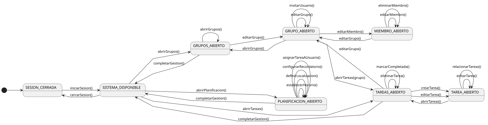

### Contexto de miembro

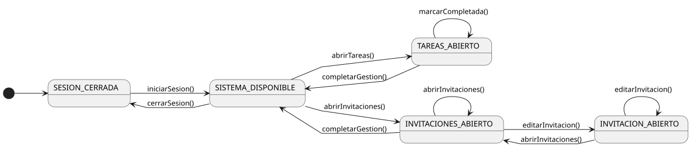

## Galeria de analisis por caso de uso

Cada bloque muestra directamente la colaboracion y la secuencia del caso. El titulo enlaza al README detallado.

### Gestion de grupos

#### [abrirGrupos()](./casos-uso/gestion-grupos/abrirGrupos/README.md)

Colaboracion de analisis:

Secuencia de analisis:

#### [abrirInvitaciones()](./casos-uso/gestion-grupos/abrirInvitaciones/README.md)

Colaboracion de analisis:

Secuencia de analisis:

#### [crearGrupo()](./casos-uso/gestion-grupos/crearGrupo/README.md)

Colaboracion de analisis:

Secuencia de analisis:

#### [editarGrupo()](./casos-uso/gestion-grupos/editarGrupo/README.md)

Colaboracion de analisis:

Secuencia de analisis:

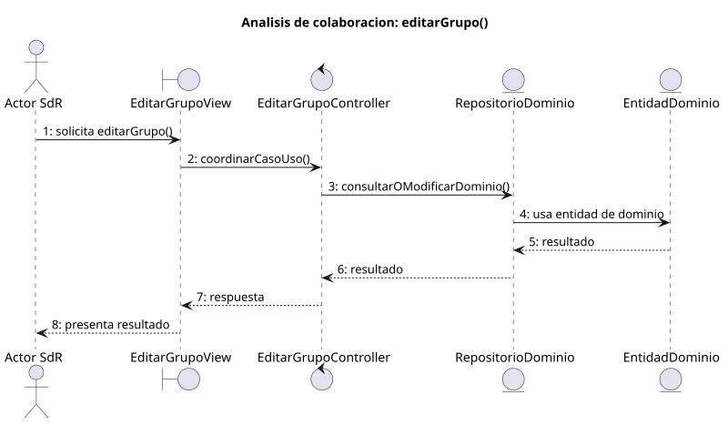

#### [editarInvitacion()](./casos-uso/gestion-grupos/editarInvitacion/README.md)

Colaboracion de analisis:

Secuencia de analisis:

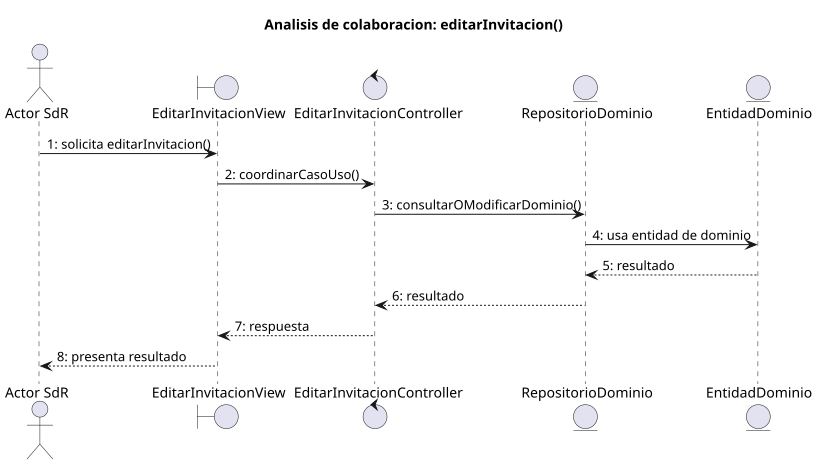

#### [editarMiembro()](./casos-uso/gestion-grupos/editarMiembro/README.md)

Colaboracion de analisis:

Secuencia de analisis:

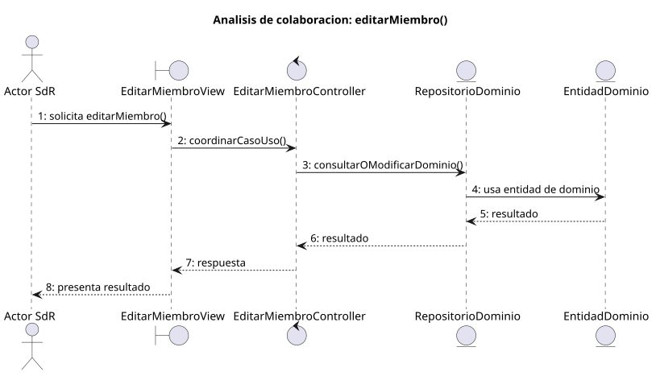

#### [eliminarGrupo()](./casos-uso/gestion-grupos/eliminarGrupo/README.md)

Colaboracion de analisis:

Secuencia de analisis:

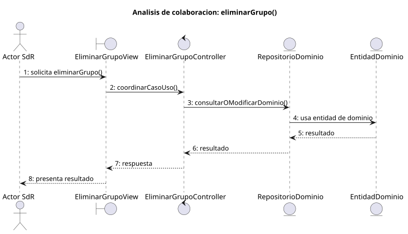

#### [eliminarMiembro()](./casos-uso/gestion-grupos/eliminarMiembro/README.md)

Colaboracion de analisis:

Secuencia de analisis:

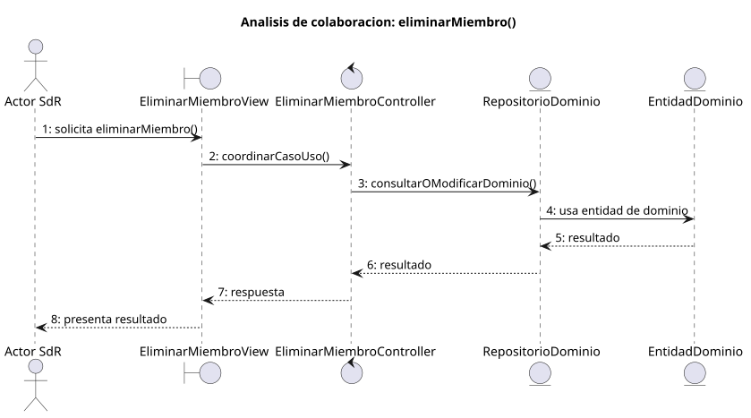

#### [invitarUsuario()](./casos-uso/gestion-grupos/invitarUsuario/README.md)

Colaboracion de analisis:

Secuencia de analisis:

### Gestion de sesion

#### [cerrarSesion()](./casos-uso/gestion-sesion/cerrarSesion/README.md)

Colaboracion de analisis:

Secuencia de analisis:

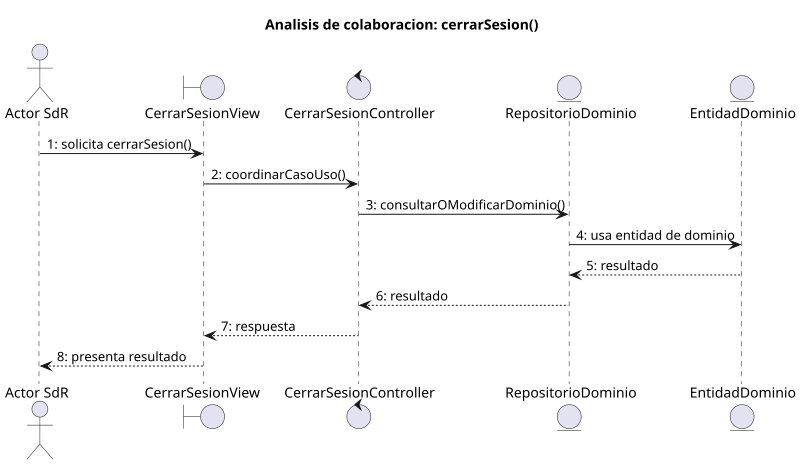

#### [completarGestion()](./casos-uso/gestion-sesion/completarGestion/README.md)

Colaboracion de analisis:

Secuencia de analisis:

#### [iniciarSesion()](./casos-uso/gestion-sesion/iniciarSesion/README.md)

Colaboracion de analisis:

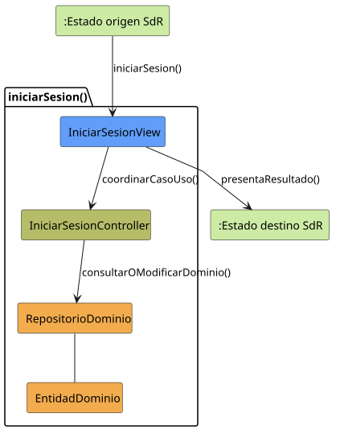

Secuencia de analisis:

### Gestion de tareas

#### [abrirTareas()](./casos-uso/gestion-tareas/abrirTareas/README.md)

Colaboracion de analisis:

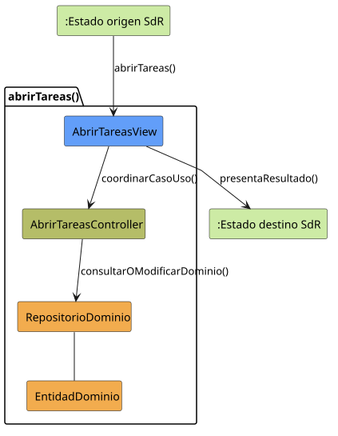

Secuencia de analisis:

#### [crearTarea()](./casos-uso/gestion-tareas/crearTarea/README.md)

Colaboracion de analisis:

Secuencia de analisis:

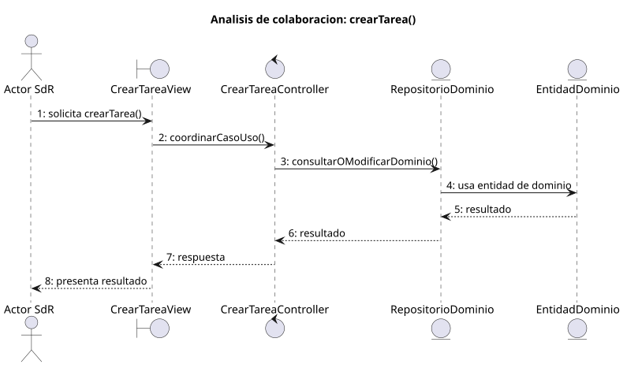

#### [editarTarea()](./casos-uso/gestion-tareas/editarTarea/README.md)

Colaboracion de analisis:

Secuencia de analisis:

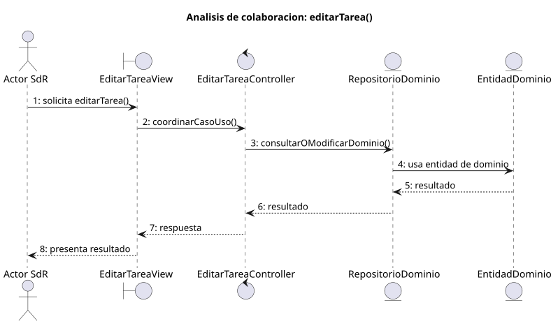

#### [eliminarTarea()](./casos-uso/gestion-tareas/eliminarTarea/README.md)

Colaboracion de analisis:

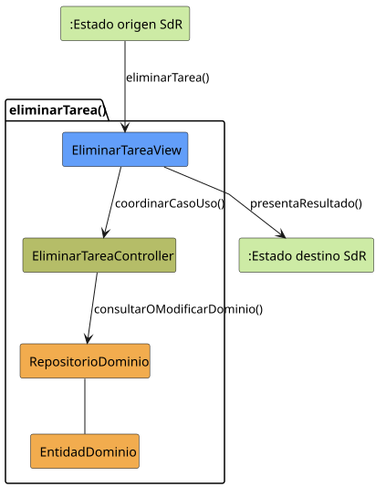

Secuencia de analisis:

#### [marcarCompletada()](./casos-uso/gestion-tareas/marcarCompletada/README.md)

Colaboracion de analisis:

Secuencia de analisis:

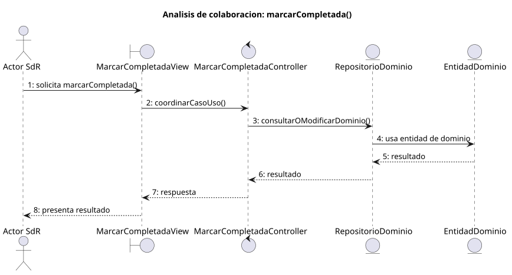

#### [relacionarTareas()](./casos-uso/gestion-tareas/relacionarTareas/README.md)

Colaboracion de analisis:

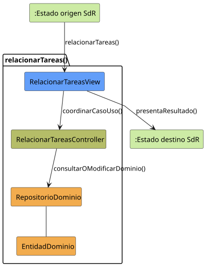

Secuencia de analisis:

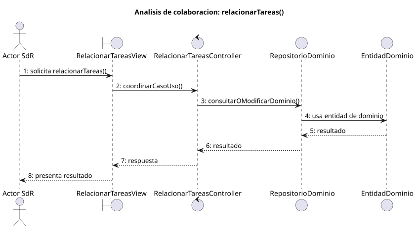

#### [validarConflicto()](./casos-uso/gestion-tareas/validarConflicto/README.md)

Colaboracion de analisis:

Secuencia de analisis:

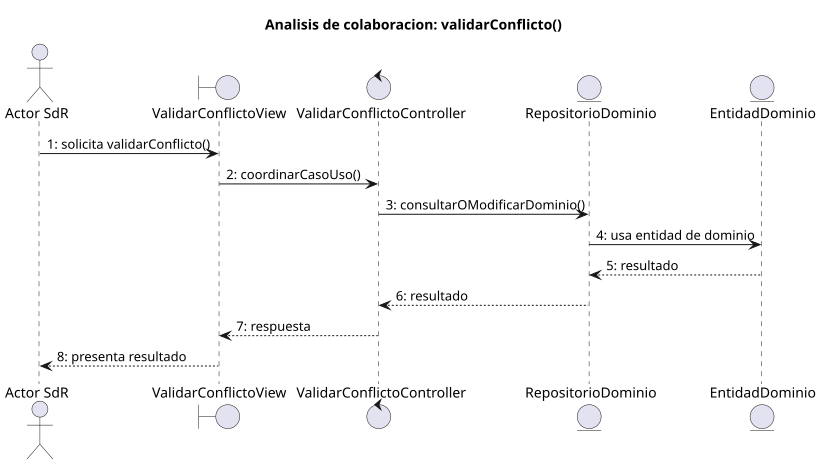

### Planificacion y configuracion

#### [abrirPlanificacion()](./casos-uso/planificacion-configuracion/abrirPlanificacion/README.md)

Colaboracion de analisis:

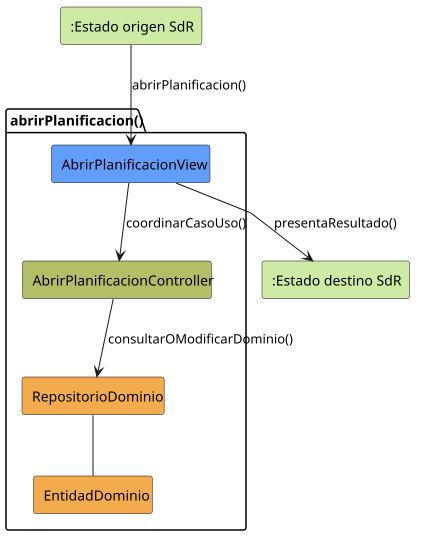

Secuencia de analisis:

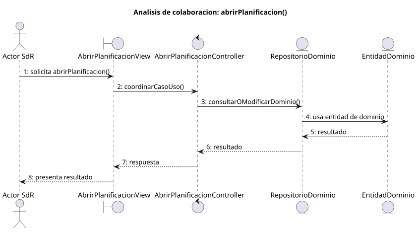

#### [asignarTareaAUsuario()](./casos-uso/planificacion-configuracion/asignarTareaAUsuario/README.md)

Colaboracion de analisis:

Secuencia de analisis:

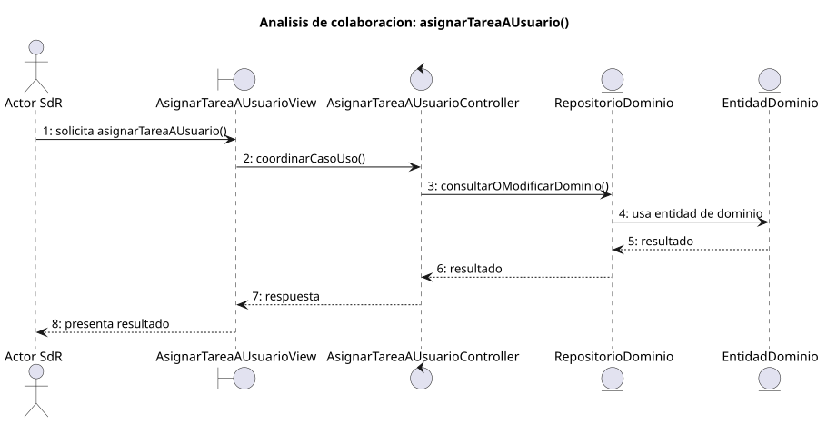

#### [configurarRecordatorio()](./casos-uso/planificacion-configuracion/configurarRecordatorio/README.md)

Colaboracion de analisis:

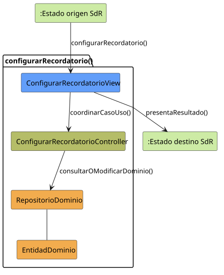

Secuencia de analisis:

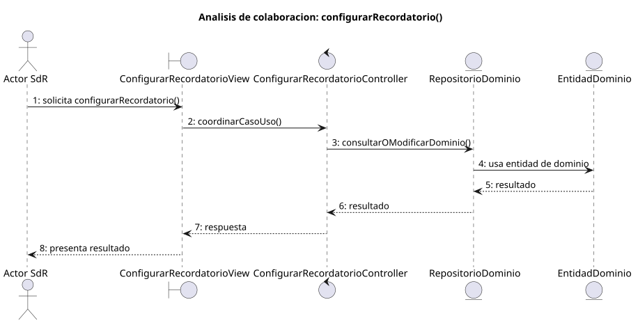

#### [definirLocalizacion()](./casos-uso/planificacion-configuracion/definirLocalizacion/README.md)

Colaboracion de analisis:

Secuencia de analisis:

#### [establecerHorario()](./casos-uso/planificacion-configuracion/establecerHorario/README.md)

Colaboracion de analisis:

Secuencia de analisis:

