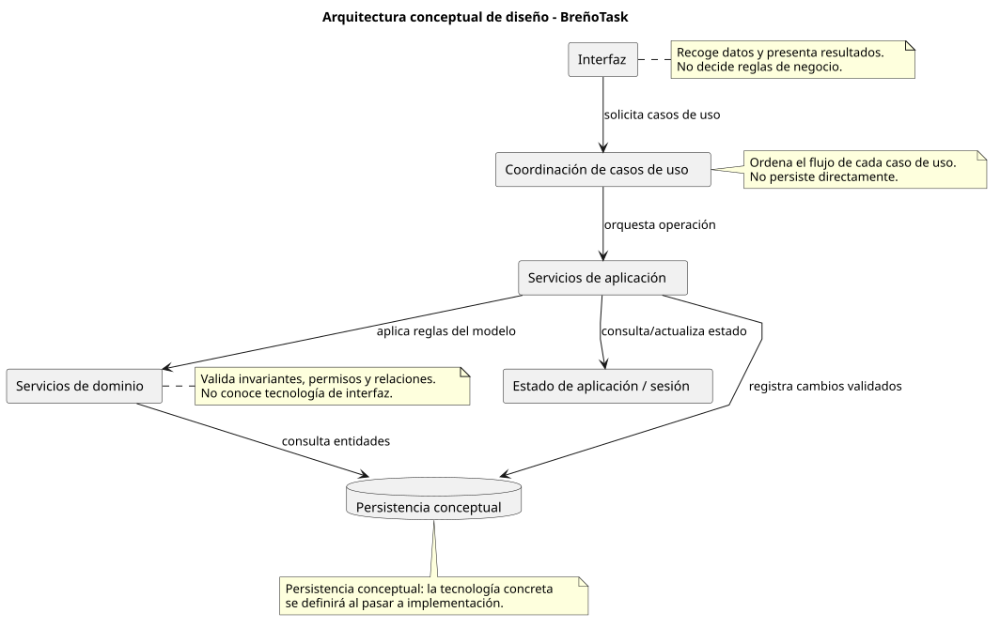
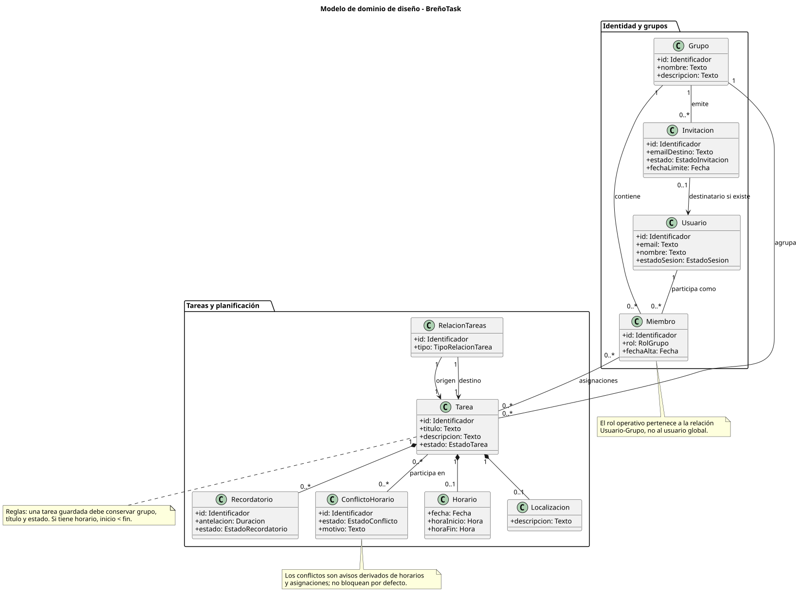

# 02-diseño

Fase de diseño de BreñoTask tras cerrar el análisis de casos de uso. Esta fase transforma los análisis en decisiones de colaboración, responsabilidades, estados y trazabilidad, sin entrar todavía en tecnología concreta de frontend, backend o base de datos.

## Propósito

- Definir una arquitectura conceptual que guíe la implementación posterior.
- Identificar participantes de diseño y responsabilidades por caso de uso.
- Mantener trazabilidad entre análisis, diseño y futuras pruebas.
- Evitar mezclar decisiones tecnológicas con decisiones de dominio antes de iniciar código.

## Artefactos generales

- [arquitectura.puml](./arquitectura.puml) / [arquitectura.svg](./arquitectura.svg): capas conceptuales y dependencias permitidas.
- [clases-diseno.puml](./clases-diseno.puml) / [clases-diseno.svg](./clases-diseno.svg): modelo de dominio de diseño.
- [configuracion-proyecto.md](./configuracion-proyecto.md): organización conceptual de diseño y reglas de responsabilidad.
- [decisiones-diseno.md](./decisiones-diseno.md): decisiones globales por módulo.
- [trazabilidad-analisis-diseno.md](./trazabilidad-analisis-diseno.md): relación entre análisis y diseño.
- [casos-uso](./casos-uso/README.md): diseño detallado de los 24 casos de uso.

## Vista rápida

### Arquitectura conceptual

Código fuente: [arquitectura.puml](./arquitectura.puml)

### Modelo de clases de diseño

Código fuente: [clases-diseno.puml](./clases-diseno.puml)

## Relación con análisis

Cada caso de uso parte de su README de análisis, su diagrama de colaboración y su secuencia de análisis. En diseño se transforma esa información en una colaboración conceptual entre interfaz, coordinador del caso, servicios, dominio, persistencia conceptual y estado de aplicación.

## Módulos funcionales

### Gestión de sesión y navegación

- [iniciarSesion()](./casos-uso/gestion-sesion/iniciarSesion/README.md)
- [cerrarSesion()](./casos-uso/gestion-sesion/cerrarSesion/README.md)
- [completarGestion()](./casos-uso/gestion-sesion/completarGestion/README.md)

### Gestión de grupos y usuarios

- [abrirGrupos()](./casos-uso/gestion-grupos/abrirGrupos/README.md)
- [crearGrupo()](./casos-uso/gestion-grupos/crearGrupo/README.md)
- [editarGrupo()](./casos-uso/gestion-grupos/editarGrupo/README.md)
- [eliminarGrupo()](./casos-uso/gestion-grupos/eliminarGrupo/README.md)
- [invitarUsuario()](./casos-uso/gestion-grupos/invitarUsuario/README.md)
- [editarMiembro()](./casos-uso/gestion-grupos/editarMiembro/README.md)
- [eliminarMiembro()](./casos-uso/gestion-grupos/eliminarMiembro/README.md)
- [abrirInvitaciones()](./casos-uso/gestion-grupos/abrirInvitaciones/README.md)
- [editarInvitacion()](./casos-uso/gestion-grupos/editarInvitacion/README.md)

### Gestión de tareas

- [abrirTareas()](./casos-uso/gestion-tareas/abrirTareas/README.md)
- [crearTarea()](./casos-uso/gestion-tareas/crearTarea/README.md)
- [editarTarea()](./casos-uso/gestion-tareas/editarTarea/README.md)
- [relacionarTareas()](./casos-uso/gestion-tareas/relacionarTareas/README.md)
- [eliminarTarea()](./casos-uso/gestion-tareas/eliminarTarea/README.md)
- [marcarCompletada()](./casos-uso/gestion-tareas/marcarCompletada/README.md)
- [validarConflicto()](./casos-uso/gestion-tareas/validarConflicto/README.md)

### Planificación y configuración

- [abrirPlanificacion()](./casos-uso/planificacion-configuracion/abrirPlanificacion/README.md)
- [establecerHorario()](./casos-uso/planificacion-configuracion/establecerHorario/README.md)
- [definirLocalizacion()](./casos-uso/planificacion-configuracion/definirLocalizacion/README.md)
- [configurarRecordatorio()](./casos-uso/planificacion-configuracion/configurarRecordatorio/README.md)
- [asignarTareaAUsuario()](./casos-uso/planificacion-configuracion/asignarTareaAUsuario/README.md)

## Pendiente antes de implementación

- Seleccionar tecnología concreta y documentarla en la fase de implementación.
- Convertir los participantes conceptuales en componentes, servicios y almacenamiento reales.
- Priorizar el primer incremento de construcción.
- Añadir pruebas ejecutables cuando exista código.