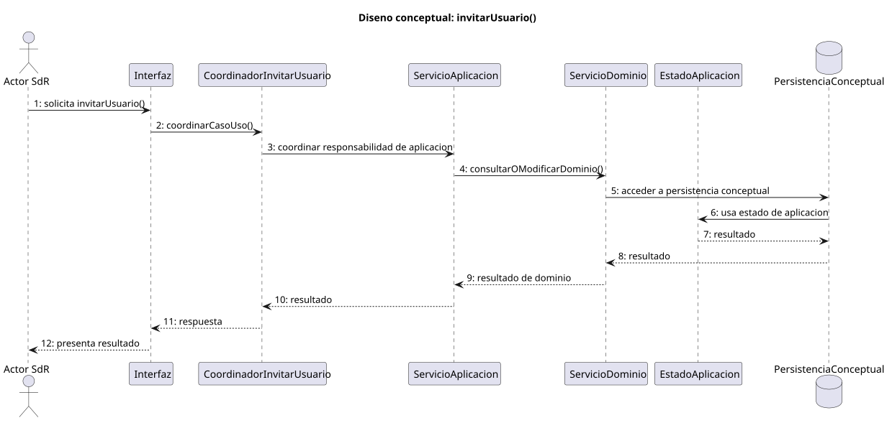
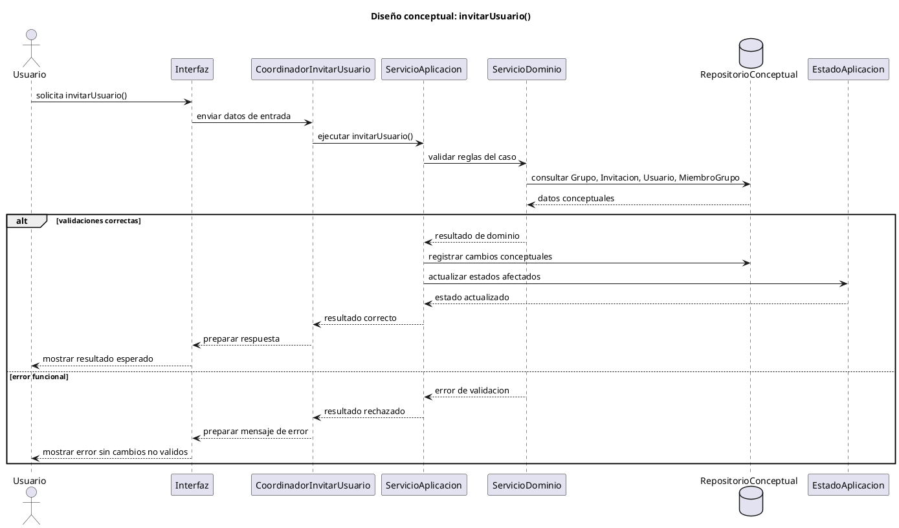

# invitarUsuario() > Diseño

## Información del artefacto

| Campo | Valor |
| --- | --- |
| Proyecto | BreñoTask |
| Fase RUP | Elaboración |
| Disciplina | Diseño |
| Versión | 1.0 |
| Autor | Equipo de desarrollo |
| Caso de uso relacionado | invitarUsuario() |
| Módulo funcional | Gestión de grupos y usuarios |

## Propósito

Diseñar la creación de una invitación para incorporar un usuario a un grupo.

## Participantes de diseño

| Participante | Tipo | Responsabilidad |
| --- | --- | --- |
| Usuario | Actor | Inicia el caso de uso y recibe el resultado funcional. |
| Interfaz de usuario | Límite conceptual | Recoge datos, muestra validaciones y presenta el resultado. |
| Coordinador del caso de uso | Control | Ordena el flujo de invitarUsuario() y decide qué servicio invocar. |
| Servicio de aplicación | Aplicación | Ejecuta la operación de diseño y coordina persistencia, dominio y estado. |
| Servicio de dominio | Dominio | Aplica reglas, permisos y validaciones del modelo. |
| Repositorio conceptual / persistencia conceptual | Persistencia conceptual | Consulta o registra los datos necesarios sin fijar tecnología. |
| Estado de aplicación o sesión | Estado | Mantiene el estado navegacional y operativo afectado por el caso. |
| Entidades de dominio implicadas | Dominio | Grupo, Invitacion, Usuario, MiembroGrupo. |

## Decisiones de diseño

- Datos necesarios: grupo, email invitado, rol propuesto y fecha límite si aplica.
- Entidades afectadas: Grupo, Invitacion, Usuario, MiembroGrupo.
- Cambios de estado: GRUPO_ABIERTO, INVITACION_ABIERTA.
- Relación con otros casos de uso: el caso se integra dentro del módulo Gestión de grupos y usuarios y respeta las transiciones definidas en análisis.
- Decisión específica: La invitación no crea miembro hasta que sea aceptada por el destinatario.
- Aspectos pendientes para implementación: concretar componentes, almacenamiento y mecanismo técnico sin cambiar la responsabilidad conceptual diseñada.

## Flujo de diseño

1. El usuario solicita invitarUsuario() desde la interfaz.
2. La interfaz recoge los datos necesarios y los entrega al coordinador del caso de uso.
3. El coordinador invoca el servicio de aplicación correspondiente.
4. El servicio de aplicación solicita al servicio de dominio la validación de reglas, permisos y consistencia.
5. El servicio de dominio consulta el repositorio conceptual o el estado de aplicación cuando necesita datos previos.
6. Si las validaciones son correctas, el servicio de aplicación registra los cambios conceptuales y actualiza los estados afectados.
7. La interfaz presenta el resultado al usuario.
8. Si aparece un error funcional, se informa sin aplicar cambios no válidos.

## Estados afectados

GRUPO_ABIERTO, INVITACION_ABIERTA

## Validaciones

- El grupo debe existir.
- El usuario actual debe poder invitar.
- El email debe ser válido.
- No debe existir invitación pendiente duplicada.

## Excepciones o errores

- Grupo inexistente.
- Email inválido.
- Invitación duplicada.
- Permisos insuficientes.

## Resultado esperado

Queda registrada una invitación pendiente asociada al grupo.

## Trazabilidad

| Elemento de análisis usado | Decisión de diseño derivada | Entidad o módulo afectado | Estado |
| --- | --- | --- | --- |
| [README de análisis](../../../../01-analisis/casos-uso/gestion-grupos/invitarUsuario/README.md) | Convertir el comportamiento funcional en colaboración entre interfaz, coordinador y servicios conceptuales. | Gestión de grupos y usuarios | diseñado |
| [Diagrama de colaboración](../../../../01-analisis/casos-uso/gestion-grupos/invitarUsuario/colaboracion.puml) | Mantener separación entre límite, control y dominio sin fijar tecnología. | CoordinadorInvitarUsuario, ServicioAplicacion, ServicioDominio | diseñado |
| [Secuencia de análisis](../../../../01-analisis/casos-uso/gestion-grupos/invitarUsuario/secuencia.puml) | Preservar orden de interacción y estados principales. | EstadoAplicacion, Grupo, Invitacion, Usuario, MiembroGrupo | diseñado |
| Revisión previa al diseño | Aplicar criterios transversales de permisos, estados y consistencia. | Modelo de dominio de diseño | diseñado |

## PlantUML del flujo de diseño

## Artefactos

- [secuencia.puml](./secuencia.puml)
- [secuencia.svg](./secuencia.svg)