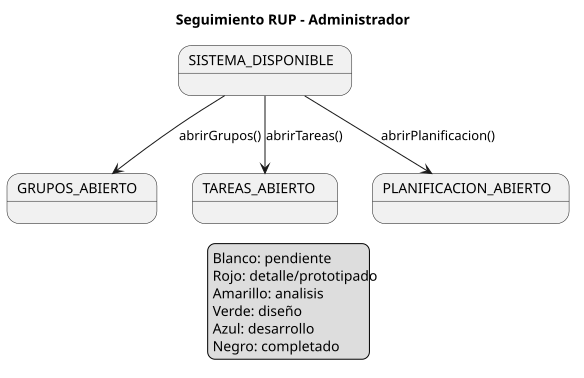

# 99-seguimiento

Dashboard de avance del proyecto RUP. Esta carpeta se usa para mantener una
vista rapida del estado del trabajo y de los artefactos visuales que ayudan a
entender cada incremento.

## Dashboard de avance por modulo

| Modulo | Analisis | Diseño | Desarrollo | Pruebas | Observacion |
| --- | --- | --- | --- | --- | --- |
| Gestion de sesion y navegacion | Completo | Completo | Primer vertical implementado | Smoke manual | React + FastAPI + SQLite en `app/` |
| Gestion de grupos y usuarios | Completo | Completo | En progreso | Smoke manual | Implementados `abrirGrupos()` y `crearGrupo()` |
| Gestion de tareas | Completo | Completo | Pendiente | Pendiente | No iniciado en codigo |
| Planificacion y configuracion | Completo | Completo | Pendiente | Pendiente | No iniciado en codigo |

## Regla de claridad visual

- Cada vez que se cree o modifique un archivo `.puml`, debe generarse su `.svg`
  equivalente en la misma carpeta.
- El README de la carpeta debe mostrar el `.svg` y enlazar tambien el `.puml`
  fuente.
- Si se implementa un nuevo incremento, este dashboard y el
  `conversation-log.md` deben actualizarse en la misma tanda de trabajo.
- Los estados internos de RUP pueden aparecer en documentacion tecnica, pero la
  interfaz de usuario debe mostrarlos con texto entendible.

## Diagrama de contexto de seguimiento

Fuente editable: [diagrama-contexto-admin.puml](./diagrama-contexto-admin.puml)

Vista SVG: [diagrama-contexto-admin.svg](./diagrama-contexto-admin.svg)

## Pendiente

- Mantener este dashboard en cada nuevo avance.
- Añadir nuevas vistas visuales cuando se implementen grupos, tareas o
  planificacion.
- Registrar pruebas ejecutables cuando el proyecto crezca mas alla del smoke
  manual.
